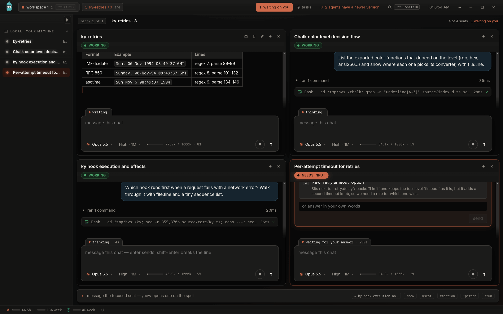
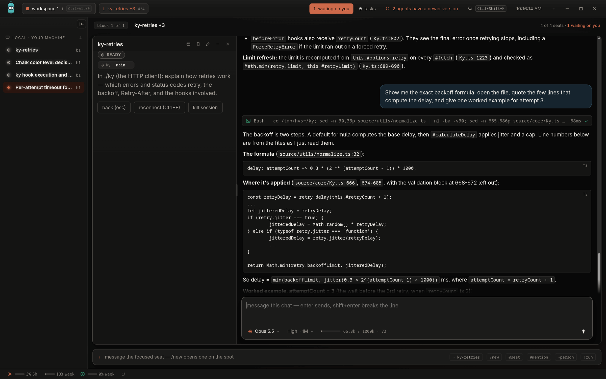
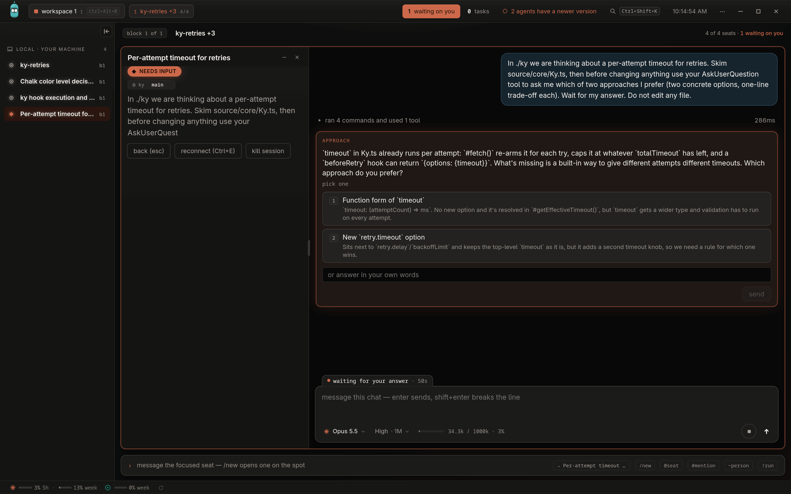
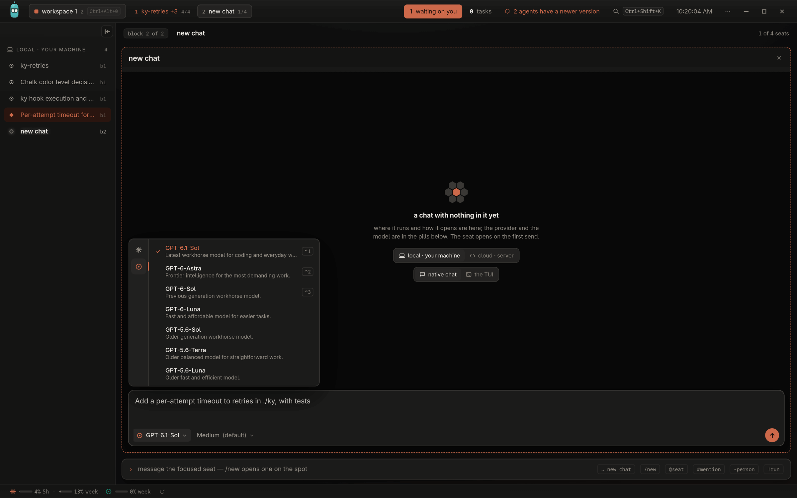

<h1 align="center">Hive 🐝</h1>

<p align="center">
  <strong>Run a fleet of coding agents and watch all of them at once.</strong>
</p>

<p align="center">
  <a href="https://github.com/arvoreeducacao/hive/releases/latest">Download</a> ·
  <a href="docs/run-your-own.md">Run your own server</a> ·
  <a href="docs/meetings.md">Meetings</a> ·
  <a href="docs/releasing.md">Releasing</a> ·
  <a href="SECURITY.md">Security</a> ·
  <a href="CONTRIBUTING.md">Contributing</a> ·
  <a href="LICENSE">Apache 2.0</a>
</p>

<p align="center">
  <a href="https://github.com/arvoreeducacao/hive/actions/workflows/ci.yml"></a>
  <a href="https://github.com/arvoreeducacao/hive/releases/latest"></a>
  
</p>

<p align="center">
  
</p>

<p align="center">
  <sub><em>Four agents, four tasks, one wall. The one that needs you says so.</em></sub>
</p>

---

## What is this, really?

Hive is a desktop app for people who stopped running one coding agent at a time.

Every session is a **seat**: a tile on a wall, with a real terminal behind it.
You open a seat on a repository and a branch, tell it what you want, and it
works. Seats read each other's screens and ask each other questions. When one
stops and needs you, its tile says so, and with a server of your own your phone
buzzes and you answer from there.

It does not replace your agent. It runs the one you already use, signed in the
way you already signed in: the Claude Code CLI by default, and Codex, Kimi,
Kiro, Cursor and OpenCode as first-class seats too. Same tile, same tools, same
archive, whatever the provider.

Yes, it is another AI developer tool. The difference is the shape: not one chat
in a sidebar, but a wall of them, and a way to step away from the wall without
the work stopping.

---

## Stuff you do in Hive

- **Fan out a morning of work.** Three bugs, a refactor and a review, each in
  its own seat, each on its own branch. You read the wall, not five terminals.
- **Answer only what needs you.** A seat that hits a question or a decision
  lights up. The rest keep going.
- **Let seats talk to each other.** One seat peeks at another's screen or asks
  it something, so the seat writing the API and the seat writing the client stop
  guessing.
- **Close the laptop.** With a server of your own, the sessions live there. The
  laptop and the phone are just a screen and a keyboard.
- **Hand a seat to a teammate.** Invite people to your server and they see and
  answer the same seats, with their own keys.
- **Switch agents per seat.** Claude on one tile, Codex on the next, a cheaper
  model for the boring one, picked from the composer.

---

## A look inside

<table>
  <tr>
    <td width="50%" valign="top">
      <br>
      <sub><strong>A seat is a real session.</strong> Streamed text, tool cards, interrupt and resume.</sub>
    </td>
    <td width="50%" valign="top">
      <br>
      <sub><strong>It finds you.</strong> A seat that needs a decision stops and asks.</sub>
    </td>
  </tr>
  <tr>
    <td colspan="2" valign="top">
      <br>
      <sub><strong>Any agent, same tile.</strong> Pick the agent, the model and the effort per seat.</sub>
    </td>
  </tr>
</table>

---

## Get it

> [!WARNING]
> **Hive is alpha software.** It is open so people can try it and tell us what
> breaks, not because it is finished.
>
> - Anything can change between releases: settings, the files under `~/.hive`,
>   the HTTP routes, the extension hooks. There is no migration promise yet.
> - Seats run coding agents with a shell and no approval prompts. Point them only
>   at code and machines you are willing to let an agent change. Read
>   [SECURITY.md](SECURITY.md) before you run a server anyone else can reach.
> - The team that builds it uses it every day, on Linux and macOS. Windows has
>   had the least use.
>
> Bugs and rough edges go in [issues](https://github.com/arvoreeducacao/hive/issues).

**Download the app** from the [latest release](https://github.com/arvoreeducacao/hive/releases/latest):

| System | File |
|---|---|
| macOS (Apple silicon) | [`Hive-arm64.dmg`](https://github.com/arvoreeducacao/hive/releases/latest/download/Hive-arm64.dmg) |
| Linux (x86_64) | [`Hive-x86_64.AppImage`](https://github.com/arvoreeducacao/hive/releases/latest/download/Hive-x86_64.AppImage) or [`Hive-x86_64.rpm`](https://github.com/arvoreeducacao/hive/releases/latest/download/Hive-x86_64.rpm) |
| Windows (x64) | [`Hive-x64.exe`](https://github.com/arvoreeducacao/hive/releases/latest/download/Hive-x64.exe) |

The builds are not signed yet. On macOS, allow the app once in **System
Settings → Privacy & Security**. On Windows, SmartScreen warns once. The app
offers each new release on its own.

**What the machine needs**

| Tool | Why |
|---|---|
| git | the seats work on repositories |
| tmux | every local seat lives in a tmux window (not needed on Windows) |
| the GitHub CLI, `gh`, signed in (`gh auth login`) | the pull request panel, reviews and merges |
| at least one agent CLI, signed in | the seats themselves: the [Claude Code CLI](https://docs.anthropic.com/en/docs/claude-code) by default, or Codex, Kimi, Kiro, Cursor or OpenCode |

**The first run** walks you through four steps, about five minutes:

1. **hello**: your name, and the folder your work lives in. Point it at a folder
   that holds your repositories; a seat opens on one of them.
2. **your machine**: it checks the tools above and, for anything missing, gives
   the install command for your system.
3. **your key**: it makes the Ed25519 key that identifies this machine.
4. **first flight**: opens your first chat, which introduces itself and asks you
   a question. Answer it, and you are in.

Everything the app keeps sits in `~/.hive`. Your agent's own login stays where
that agent keeps it; the hive never asks for it.

<details>
<summary><strong>Build it from source</strong></summary>

You need Node.js 22 or newer, with npm, on top of the tools above.

```
cd app
npm ci
npm run deps:server
npm run app
```

The second install is the server's, which the app starts on its own. Skip it and
the app opens, but a chat has no agent to talk to.

</details>

---

## Two ways to run it

**The app on its own.** Seats run on your machine, in tmux, or in native ptys on
Windows. Nothing to host, nothing to configure, nothing of yours reachable from
outside.

**The app and a server.** One container holds the sessions and the state. Your
laptop becomes a client, and so does your phone, and so do the people you
invite. Close the laptop and the work carries on.

```
cd infra/docker
docker compose up
```

That is the whole thing: one image with node, git, tmux and the agent inside,
answering on `http://127.0.0.1:8791`. Compose publishes the port on `127.0.0.1`
only, so the box is reachable from your machine and nowhere else until you say
otherwise. [docs/run-your-own.md](docs/run-your-own.md) is the guide: where state
lives, how the server learns to trust your key, and how to put it on a machine
that has an address.

**What a seat actually is, before you start one.** A seat runs a coding agent
with a shell and no approval prompts, by design. It edits, installs, commits and
runs whatever it decides to, on everything you mount. The container holds it in,
but it is not a sandbox: [SECURITY.md](SECURITY.md) says exactly what it does and
does not hold back.

The phone, a server in the cloud and inviting other people all need a server you
host yourself. On the app alone, everything runs on your machine.

---

## Three little stories

**The wall.** It is 9am and there are five things to do. You open five seats,
one per branch, and type five sentences. By coffee, two have pull requests, one
is waiting on a question, and two are still reading the code. You answer the
question and go back to your own work.

**The commute.** A seat needs a decision while you are on the train. Your phone
buzzes, you read what it found, you pick option B. It was done before you got
off.

**The pair.** A seat on the API and a seat on the client disagree about a field
name. One asks the other, they settle it, and you read the answer on the wall
instead of carrying it between two terminals.

---

## How it holds together

```
┌───────────────────┐   ┌───────────────────┐   ┌───────────────────┐
│   desktop app     │   │   phone (PWA)     │   │   a teammate      │
│   Electron        │   │   /phone/         │   │   another app     │
└─────────┬─────────┘   └─────────┬─────────┘   └─────────┬─────────┘
          │  signed HTTP, every request, clients only dial out
          ▼                       ▼                       ▼
┌─────────────────────────────────────────────────────────────────────┐
│                         server (or the app alone)                   │
│   sessions · identity · roster · invites · sealed log (/sync/)      │
└──────────────────────────────────┬──────────────────────────────────┘
                                   │
               ┌───────────────────┼───────────────────┐
               ▼                   ▼                   ▼
        Claude Code           Codex · Kimi        Kiro · Cursor
           (tmux)             (app-server/ACP)    OpenCode
```

Three pieces, and only one of them keeps state: a desktop app, a server, and a
phone page the server itself serves. **Nothing listens on anybody's machine**:
clients only dial out.

The phone never reads a conversation off the server in the clear. Each chat has
a key of its own, made on the machine that runs it. Every line, picture and
answer travels sealed with that key, in a numbered log the server keeps but
cannot open. The key reaches your phone wrapped for its own public key, so a new
device sees the whole chat and a revoked one sees nothing new.

Identity is an Ed25519 key in `ssh-keygen` format. There is no bearer token
anywhere: every request carries its own signature, bound to the fingerprint of
the server it is addressed to. Pairing never transmits a secret.

The protocol is HTTP and the routes live in `server/`. What the phone can do,
the desktop app can do, over the same routes.

<details>
<summary><strong>The agents</strong></summary>

The agent is the Claude Code CLI by default. Codex runs as a first-class seat
through its app-server, with the same tile: streamed text, tool cards, questions
you answer from the app, interrupt and resume. OpenCode works one turn at a
time. Kimi Code CLI runs through `kimi acp` (Agent Client Protocol), with
streamed text and thinking, tool cards, stop, resume, `/model`, `/compact` and
`/context`. Kiro CLI runs through `kiro-cli acp`, with `/effort` and a real
`/mcp` on top. Cursor CLI runs through `cursor-agent acp`, signed in with the
CLI's own login.

Whatever the agent, the seat comes back after a restart, sits in the archives,
revives on the same agent and takes the hive's autocompact ceiling (see
[the same hive, whatever the provider](docs/run-your-own.md#the-same-hive-whatever-the-provider)).

</details>

<details>
<summary><strong>The layout</strong></summary>

| Folder | What |
|---|---|
| `app/` | the desktop app, Electron, and the client behind it |
| `server/` | the server: sessions, identity, roster, peers, invites |
| `server/sync/` | the sealed log the phone reads: keys, broker, client, runner |
| `server/phone/` | the phone page, served by the server at `/phone/` |
| `infra/docker/` | the image, the boot script, the compose file |
| `docs/` | running your own, meetings, releasing |
| `site/` | the documentation site |
| `raycast/` | a Raycast extension that opens and answers chats without switching to the app |

</details>

<details>
<summary><strong>Meetings and Aveia</strong></summary>

The hive records Meet calls from their captions, on your machine. Sending them
to Aveia, a separate meetings service, is optional and needs an Aveia you host
yourself: [docs/meetings.md](docs/meetings.md).

</details>

<details>
<summary><strong>Extensions</strong></summary>

What runs on top of the hive without being part of it: folders anyone copies
into a hub or a machine and turns on in the app. The contract is in
[`app/extensions/README.md`](app/extensions/README.md). The ones anyone can
install, Linear first, live in
[arvoreeducacao/hive-extensions](https://github.com/arvoreeducacao/hive-extensions).

</details>

---

## What it is not

- Not an agent. It runs the agents you already have, with their own logins.
- Not a sandbox. A seat has a shell, and it uses it. Point it at what you are
  willing to let it change.
- Not a cloud service. There is no account to make. The server, if you want one,
  is yours.
- Not finished. It is alpha, and we will tell you what works and what does not.

**What it is:** one wall where a person runs many agents at once, and a way to
leave the wall without the work stopping.

---

## Contributing

[CONTRIBUTING.md](CONTRIBUTING.md). Found something that looks like a hole?
[SECURITY.md](SECURITY.md) first, please, not an issue.

<p align="center">
  <sub>Hive 🐝</sub><br>
  <sub>Apache 2.0 · Built by <a href="https://github.com/arvoreeducacao">Árvore</a></sub>
</p>
