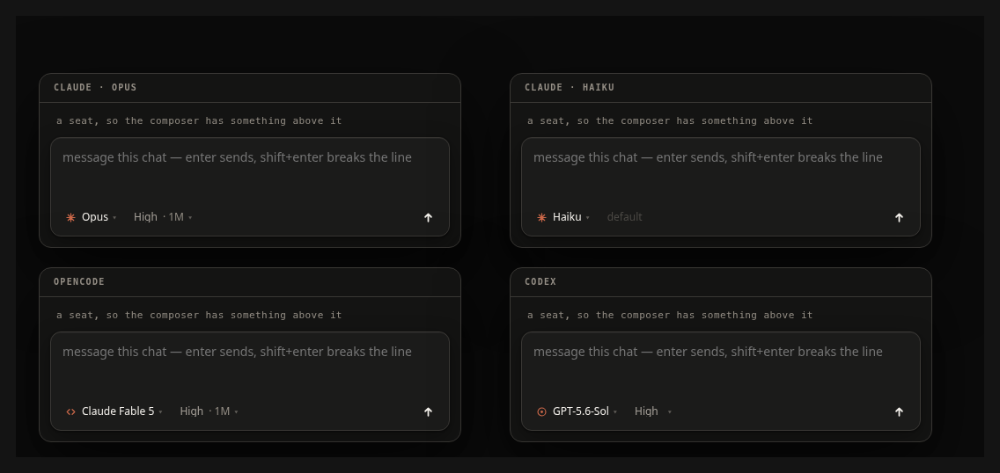
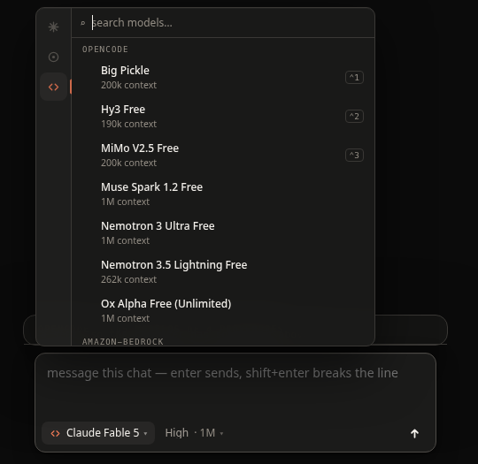
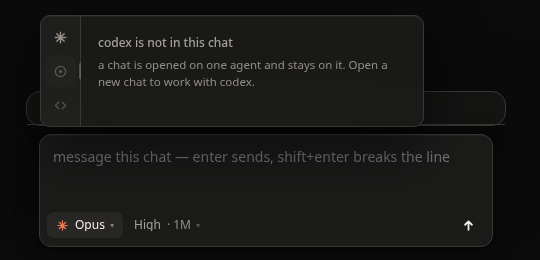

# O rodapé do composer

O que o chat nativo mostra sobre o modelo e o raciocínio da sessão, e de onde
esses valores vêm. Nenhuma lista de modelos é escrita no hive: as três CLIs
respondem por si.

| agente | onde o hive pergunta |
|---|---|
| claude | Agent SDK, `supportedModels()` |
| codex | `codex app-server`, JSON-RPC `model/list` |
| opencode | `opencode models --verbose` |

## As pastilhas

Modelo e raciocínio sempre, em todo assento nativo. Um controle que aparece e
some faz o rodapé dançar e deixa a pessoa sem saber se o chat tem aquilo. A
terceira, a da conta, é a exceção: numa máquina com um login só não há nada
para escolher, e ela não entra no rodapé — a caixa de nova conversa esconde a
dela pelo mesmo motivo.

O nome do modelo vem da CLI; a janela de contexto viaja ao lado do nível de
raciocínio. `Haiku` não expõe níveis, então a pastilha fica apagada e explica
por quê no tooltip, em vez de sumir.

## O seletor de modelo

Barra de agentes à esquerda, busca e agrupamento por provedor à direita. A
busca só aparece quando há mais de oito linhas. `Ctrl+1/2/3` nas três
primeiras.

## O seletor de raciocínio

Os níveis são os do **modelo**, não do agente — e as descrições são as que a
própria CLI dá. `ultra` só existe em parte dos modelos do codex.

## O seletor de conta

As contas são as que `hive account ls` lista, com o e-mail e o plano de cada
uma; a que o chat usa vem do próprio assento, não do comando com que o tmux o
abriu. Escolher reabre a sessão do SDK na outra conta e retoma a mesma
conversa: o que se perde é o limite, não o chat. Num assento estreito a
pastilha fica só com o ícone — três pastilhas e o medidor de contexto não
cabem lado a lado.

Ela fica apagada, explicando no tooltip, quando não há o que trocar: um chat na
nuvem usa o login do pod, um agente que não é o claude não entra com conta da
Anthropic, e um chat aberto antes deste controle não sabe dizer em qual conta
está — fechar e abrir com o mesmo nome traz a conversa de volta e resolve.

Um assento no meio de uma resposta não troca de conta: a sessão seria reaberta
por baixo da geração em curso. A pastilha diz isso e espera o turno acabar.

## O agente que não é o deste chat

Um chat nasce num agente e fica nele. A barra mostra os três e explica no
clique, em vez de esconder os outros dois e deixar a pessoa sem saber por que
não dá para trocar.
