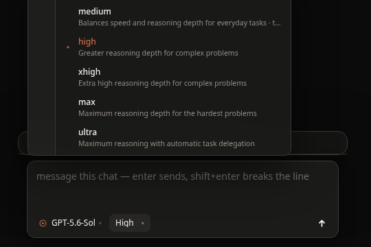

A seat runs an agent CLI. Three are supported:

| Agent | Default |
| --- | --- |
| `claude` | yes — the Claude Code CLI |
| `codex` | supported |
| `opencode` | supported |

A seat is born on one agent and stays on it.

## No model list lives in Hive

**No list of models is written down in Hive.** The three CLIs answer for
themselves:

| Agent | Where Hive asks |
| --- | --- |
| `claude` | Agent SDK, `supportedModels()` |
| `codex` | `codex app-server`, JSON-RPC `model/list` |
| `opencode` | `opencode models --verbose` |

The consequence is the point: a model that ships in a CLI update shows up in
Hive without Hive changing. There is no table to forget to update, and no way
for the picker to disagree with the tool it drives.

## The composer footer

Two pills, always both, on every native seat. A control that appears and
disappears makes the footer dance and leaves people unsure whether the chat has
that feature at all.

- **Model** — the name comes from the CLI, and the context window travels next
  to the reasoning level.
- **Reasoning** — the levels are the *model's*, not the agent's, and the
  descriptions are the ones the CLI itself gives.

A model with no reasoning levels — Haiku, above — leaves the pill dimmed and
explains why in the tooltip, instead of removing it.

## The model picker

The agent bar sits on the left; search and grouping by provider on the right.
Search only appears past eight rows. `Ctrl+1`, `Ctrl+2` and `Ctrl+3` take the
first three.

## The reasoning picker

The levels belong to the model, and so do the descriptions — Hive repeats what
the CLI says rather than writing its own. `ultra` exists only on some of the
codex models.

## An agent that is not this chat's

A chat is opened on one agent and stays on it. The bar shows all three and
explains on click, rather than hiding the other two and leaving you wondering
why you cannot switch.

## Choosing a model for a seat

A model is one of the things a seat is opened with, and it is a real choice with
a real cost. Mechanical work — renaming in bulk, translating, sweeping a pattern
across files — belongs on a cheap model and a wide fan-out, not on the most
capable one doing it by hand. Work that has to be right the first time is the
opposite.
